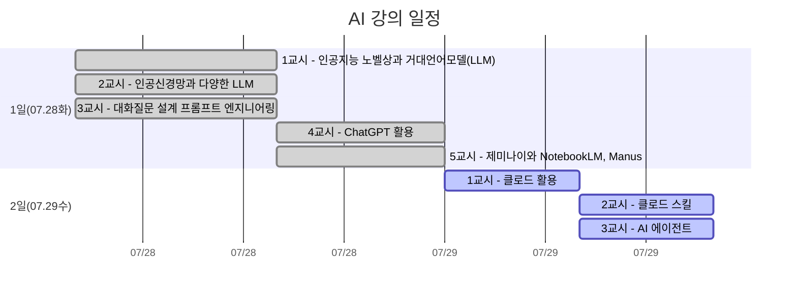

# 2026 전문대학교육협의회 하계 연수
> ## 미래 교육을 위한 AI 파트너: 다양한 거대언어모델(LLM)의 활용

---

### 연수 일정
- 연수일정: 2026년 7월 28일(화) 13시 ~ 7월 29일(수) 12시 (1박2일, 8시간)
- [연수장소: 상암 스탠포드호텔코리아 (서울 마포구 월드컵북로 58길, 15)](https://map.naver.com/p/entry/place/20315170?c=11.00,0,0,0,dh&placePath=%2Fhome%3Ffrom%3Dmap%26fromPanelNum%3D1%26additionalHeight%3D76%26timestamp%3D202607061015%26locale%3Dko%26svcName%3Dmap_pcv5%26businessCategory%3Dhotel)

### 학습 계획

| 1일차 | 교시 | 주제 || 2일차 | 교시 | 주제 |
| ---- |------|------|-|---- |------|------|
| 2026.07.28 화 | 1교시 | 인공지능 노벨상과 거대언어모델(LLM) || 2026.07.29 수 | 1교시 | 클로드 활용 |
| 2026.07.28 화 | 2교시 | 인공신경망과 다양한 LLM || 2026.07.29 수 | 2교시 | 클로드 스킬 |
| 2026.07.28 화 | 3교시 | 대화질문 설계: 프롬프트 엔지니어링 || 2026.07.29 수 | 3교시 | AI 에이전트 |
| 2026.07.28 화 | 4교시 | ChatGPT 활용 ||
| 2026.07.28 화 | 5교시 | 제미나이와 NotebookLM, Manus ||

### 카카오 playmcp 접속
- [카카오 playmcp](https://playmcp.kakao.com/?page=0)
---

### 주요 LLM 서비스

#### 글로벌 종합 LLM 서비스

| 서비스 | 제공사 | 링크 |
|---|---|---|
| ChatGPT | OpenAI | https://chat.openai.com |
| Claude | Anthropic | https://claude.ai |
| Gemini | Google | https://gemini.google.com |
| NotebookLM | Google | https://notebooklm.google.com |
| | | |
| Perplexity | 출처 기반 AI 검색 엔진 | https://www.perplexity.ai |
| Manus | 에이전트 특화 AI 서비스 | https://manus.im |
| | | |
| Grok | xAI | https://grok.com |
| Copilot | Microsoft | https://copilot.microsoft.com |
| Meta AI | Meta | https://www.meta.ai |
| Le Chat | Mistral | https://chat.mistral.ai |
| You.com | 검색 + AI 어시스턴트 결합 | https://you.com |
| | | |
| 뤼튼(Wrtn) | 뤼튼테크놀로지스 | https://wrtn.ai |
| 캐럿(Carat) | - | https://carat.im |
| Solar (Upstage) | 업스테이지 | https://console.upstage.ai |

#### 코딩·개발 특화

| 서비스 | 특징 | 링크 |
|---|---|---|
| Claude Code | 터미널/IDE 기반 에이전틱 코딩 | https://claude.com/product/claude-code |
| GitHub Copilot | IDE 내 코드 자동완성·채팅 | https://github.com/features/copilot |
| Cursor | AI 네이티브 코드 에디터 | https://cursor.sh |
| Windsurf | AI 에이전트 기반 IDE | https://windsurf.com |

#### 오픈소스·개발자용 (API/자체 호스팅)

| 모델 | 제공사 | 링크 |
|---|---|---|
| DeepSeek | DeepSeek | https://chat.deepseek.com |
| Llama | Meta | https://llama.meta.com |
| Qwen | Alibaba | https://chat.qwen.ai |
| Mistral (오픈 웨이트) | Mistral AI | https://mistral.ai |

#### API 통합 플랫폼 (여러 모델 한번에 비교/호출)

| 서비스 | 특징 | 링크 |
|---|---|---|
| OpenRouter | 다양한 LLM API를 단일 엔드포인트로 제공 | https://openrouter.ai |
| Poe | 여러 챗봇 모델을 한 화면에서 전환 사용 | https://poe.com |
| LMArena (Chatbot Arena) | 모델 간 블라인드 비교·순위 | https://lmarena.ai |

---

### 관련 도서
> 

### 관련 유튜브 동영상
> - [정보이론의 어버지 클로드 섀넌](https://www.youtube.com/watch?v=IpP6BwvKv3M)
