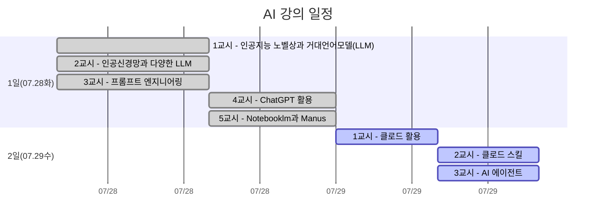

# 2026 전문대학교육협의회 하계 연수
> **미래 교육을 위한 AI 파트너: 다양한 거대언어모델(LLM)의 활용**

---

### 연수 일정
- 연수일정: 2026년 7월 28일(화) 13시 ~ 7월 29일(수) 12시 (1박2일, 8시간)
- 연수장소: 상암 스탠퍼드호텔코리아 (서울 마포구 월드컵북로 58길, 15)

### 학습 계획

| 1일차 | 교시 | 주제 || 2일차 | 교시 | 주제 |
| ---- |------|------|-|---- |------|------|
| 2026.07.28 화 | 1교시 | 인공지능 노벨상과 거대언어모델(LLM) || 2026.07.29 수 | 1교시 | 클로드 활용 |
| 2026.07.28 화 | 2교시 | 인공신경망과 다양한 LLM || 2026.07.29 수 | 2교시 | 클로드 스킬 |
| 2026.07.28 화 | 3교시 | 프롬프트 엔지니어링 || 2026.07.29 수 | 3교시 | AI 에이전트 |
| 2026.07.28 화 | 4교시 | ChatGPT 활용 ||
| 2026.07.28 화 | 5교시 | Notebooklm과 Manus ||



  
## 스킬 활용 사례
- [팀 프로젝트 보드](https://claude.site/public/artifacts/610bed12-3584-4ec1-908c-b0dd5431cbe7/embed)
- 임베디드 코드
```HTML
<iframe src="https://claude.site/public/artifacts/610bed12-3584-4ec1-908c-b0dd5431cbe7/embed" title="kanban-board.html" width="100%" height="600" frameborder="0" allow="clipboard-write" allowfullscreen></iframe>
```

