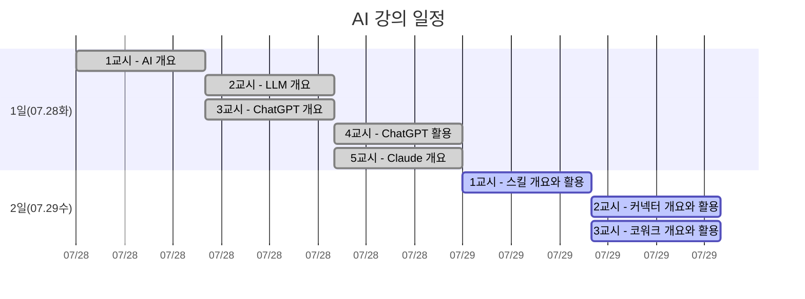
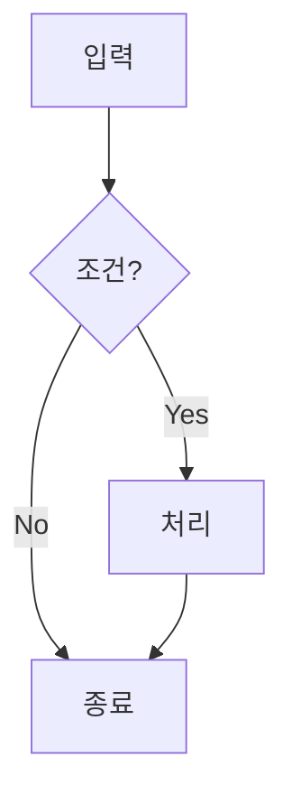
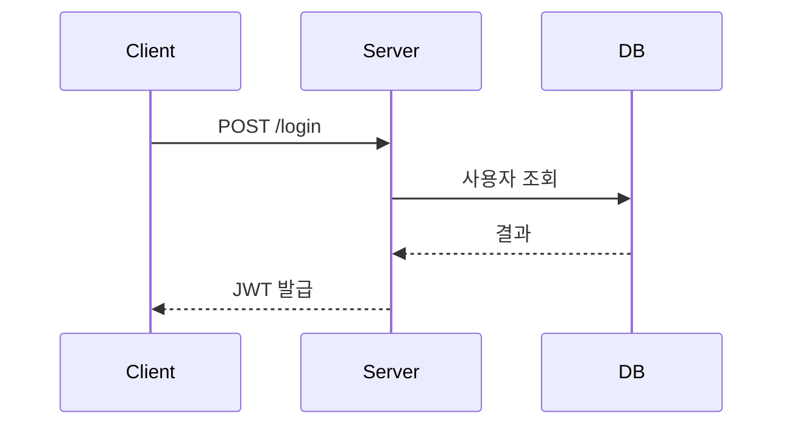
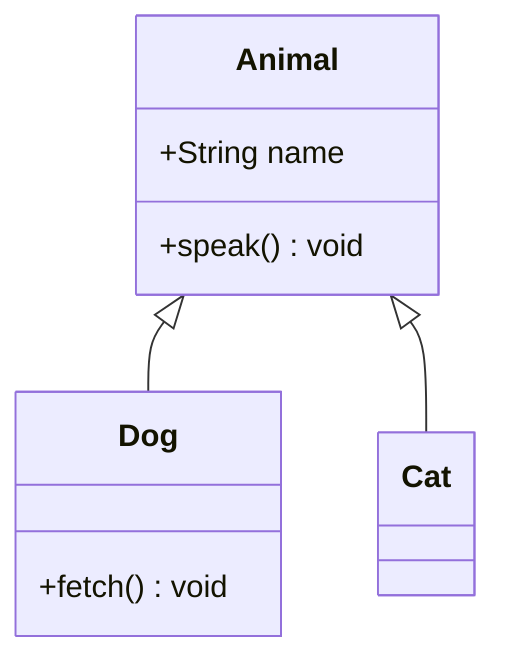
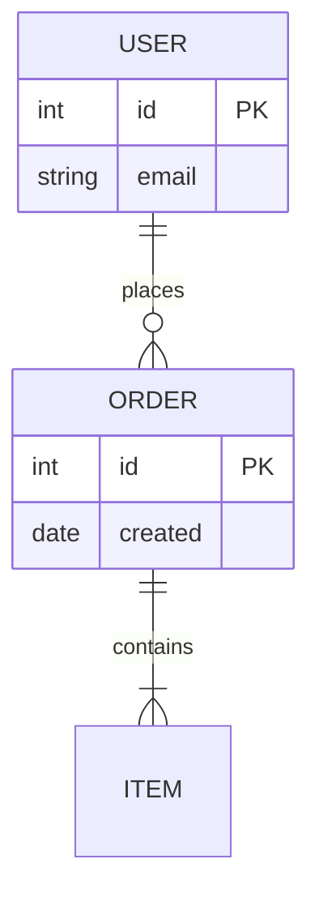
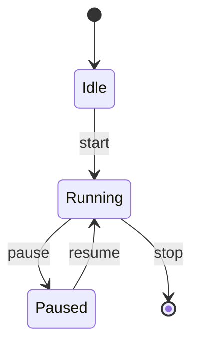
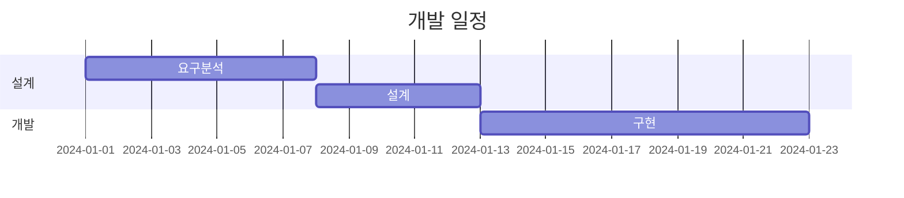
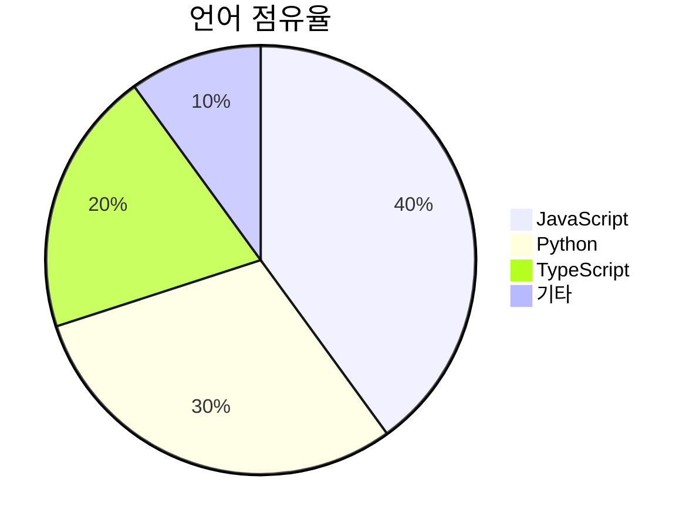
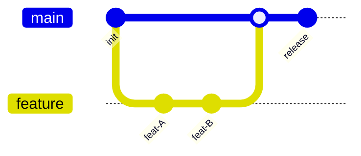

# 2026-LLM
2026 하계 연수

## 학습 계획

| 1일차 | 교시 | 주제 | 2일차 | 교시 | 주제 |
| ---- |------|------|---- |------|------|
| 2026.07.28 화 | 1교시 | 수업 소개와 AI 개요 | 2026.07.29 수 | 1교시 | 스킬 개요와 활용 |
| 2026.07.28 화 | 2교시 | LLM과 ChatGPT 개요 | 2026.07.29 수 | 2교시 | 커넥터 개요와 활용 |
| 2026.07.28 화 | 3교시 | ChatGPT와 프롬프트 활용 | 2026.07.29 수 | 3교시 | 확장 프로그램과 코워크 개요 |
| 2026.07.28 화 | 4교시 | Claude 개요 |
| 2026.07.28 화 | 5교시 | Claude 프로젝트 활용 |



    
## mermaid 종류

### flowchar


### sequenceDiagram


### classDiagram

### erDiagram


### stateDiagram


### ganttChart


### pieChart


### gitGraph


## 스킬 활용 사례
- [팀 프로젝트 보드](https://claude.site/public/artifacts/610bed12-3584-4ec1-908c-b0dd5431cbe7/embed)
- 입베디스 코드
```HTML
<iframe src="https://claude.site/public/artifacts/610bed12-3584-4ec1-908c-b0dd5431cbe7/embed" title="kanban-board.html" width="100%" height="600" frameborder="0" allow="clipboard-write" allowfullscreen></iframe>
```

## 스킬 생성 프롬프트
- 주식 관련
  ```
  다음처럼 "주식 추천에 관한 스킬"을 요청하려고 해, 먼저 다음 '스킬 요청 문장'을 적절히 수정해 줘 
  목적: 최근 주식 시황을 분석해서 실적이 좋을 섹터를 선정해 수혜가 예상하는 관련 국내 ETF와 주식 종목을 각각 5개 정도 소개해 줘 
  ETF는 과거 실적이 좋으며 수수료가 낮은 것으로 추천해 줘 
  특히 단기(1-3 개월), 중기(6-12개월), 장기(1년이상)로 나누어서 각각 종목 5개씩 설명해줘<img width="2223" height="218" alt="image" 
  ```
  

