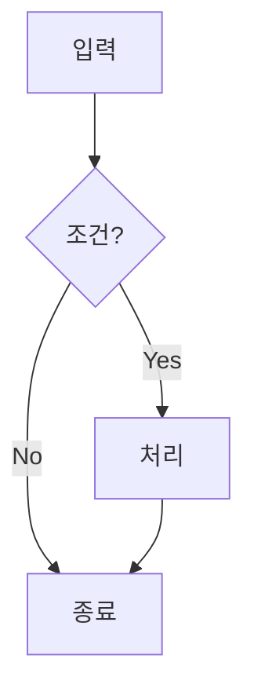
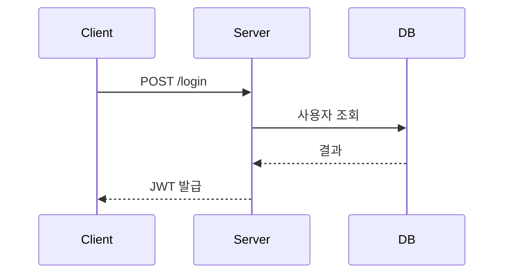
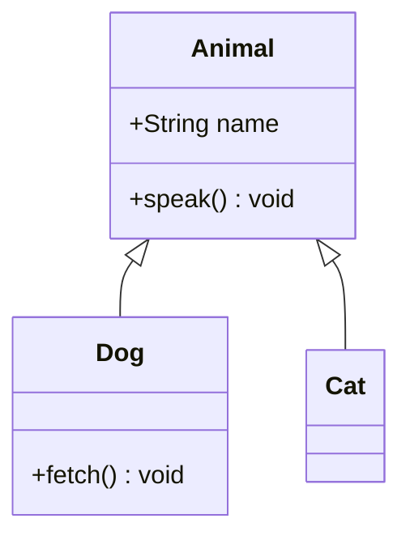
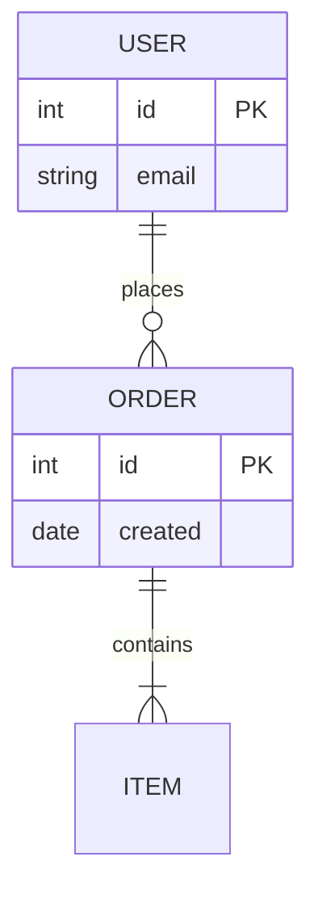
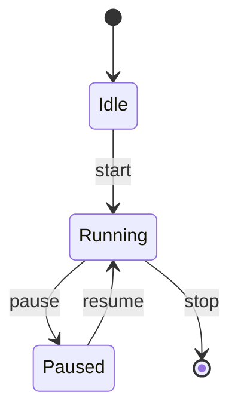
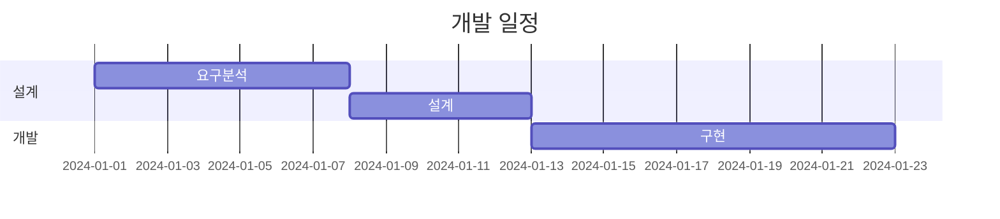
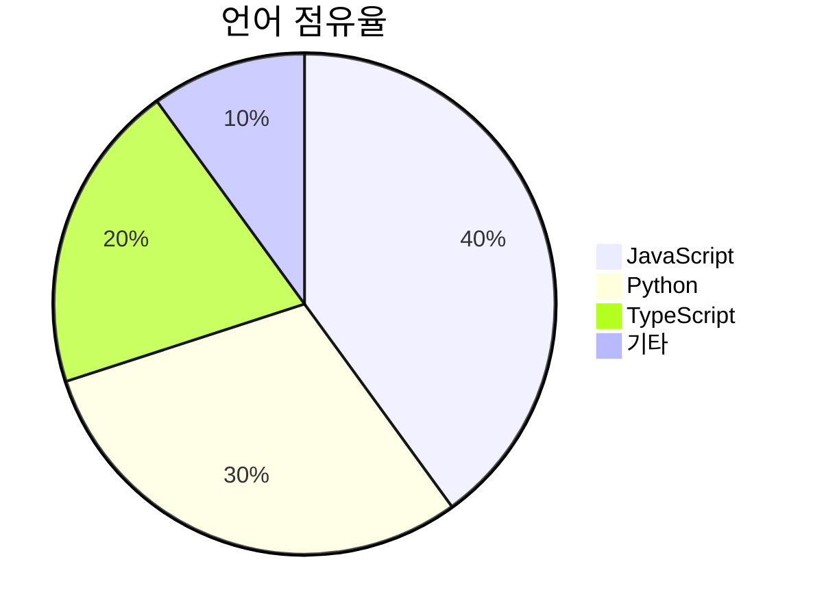
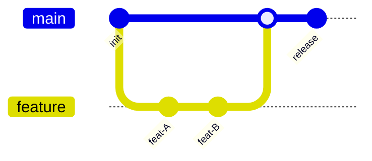

# 2026-LLM
2026 하계 연수

## 학습 계획
```mermaid
gantt
    title AI 강의 일정
    dateFormat YYYY-MM-DD
    axisFormat %m/%d

    section 1일차 (07.28 화)
    1교시: AI 개요                      :done, a1, 2026-07-28, 1d
    2교시: LLM 개요                     :done, a2, 2026-07-28, 1d
    3교시: ChatGPT 개요                 :done, a3, 2026-07-28, 1d
    4교시: ChatGPT 활용                 :done, a4, 2026-07-28, 1d
    5교시: Claude 개요 및 프로젝트 활용 :done, a5, 2026-07-28, 1d

    section 2일차 (07.29 수)
    1교시: 스킬 개요와 활용             :active, b1, 2026-07-29, 2d
    2교시: 커넥터 개요와 활용           :active, b2, 2026-07-29, 2d
    3교시: 코워크 개요와 활용           :active, b3, 2026-07-29, 2d
```
    
## mermaid 종류

### flowchar


### sequenceDiagram


### classDiagram

### erDiagram


### stateDiagram


### ganttChart


### pieChart


### gitGraph

